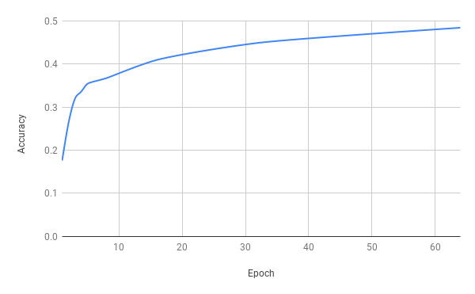
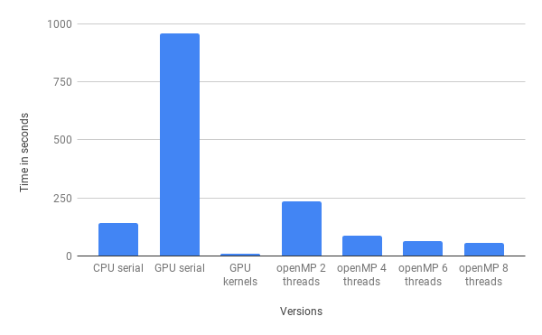

# spnn

## description
- spnn: simple parallelized neural network.
- A comparison of fully connected network (forward and backward propagation) implementations.
- Implementations are listed below,
    1. CPU single thread.
    1. CPU multiple threads using openmp.
    1. GPU single thread using cuda.
    1. GPU multiple threads using cuda.
    1. OpenBLAS.
- The task selected is digit classification on MNIST data.

## code
- Code is written in `C++/CUDA`.
- OpenMP variant uses `openmp` library.
- OpenBLAS variant uses `openblas` library.
- `include/` contains headers.
- `src/` contains all variant implementations.
- `data/` contains MNIST data.
- `proposal.pdf` contains the project proposal.
- `presentation.pdf` contains the presentation given at the end of the project.
- `report.pdf` contains details, experiments and analysis.
- `Makefile` is used to make target executables.

## documentation
- The documentation of the code is itself.

## usage
- Open a terminal in the directory containing `Makefile`.
- Use `make all` to build all targets.
- The targets are listed as follows,
    1. `cpu_serial.out`
    1. `cuda_parallel.out`
    1. `openmp.out`
    1. `openblas.out`
    1. `cuda_serial.out`
- To build a specific target use `make <target-name>`.
- To remove all targets use `make clean`.
- Use `./<target-name>` to run a target.

## demonstration

- Accuracy vs epochs for the fully connected network irrepective of implementation.

- Implementations comparision for a specfic model.

- Time taken vs Params size for different implementaions. Observe the GPU parallelized variant curve is flat at almost 0.

## roadmap
- Things to consider during analysis
  - [x] correctness (> 10% accuracy)
  - [x] repeatablity (nothing fancy)
  - [x] memory check (no mem leaks or other bad stuff using valgrind --tool=memcheck)
- [x] Initialization done uniformly in -1 to 1
- [x] Layers are numbered from 0 i.e. first hidden layer is layer 1
- [x] Control size of name field
- [x] Impl loss function
- [x] Remove memleaks from step_train
- [x] Batch gradient descent: fix loss decrement and check backprop
- [x] Normalize
- [x] Get MNIST data
- [x] Profile
- [ ] Remove data loading from time taken
